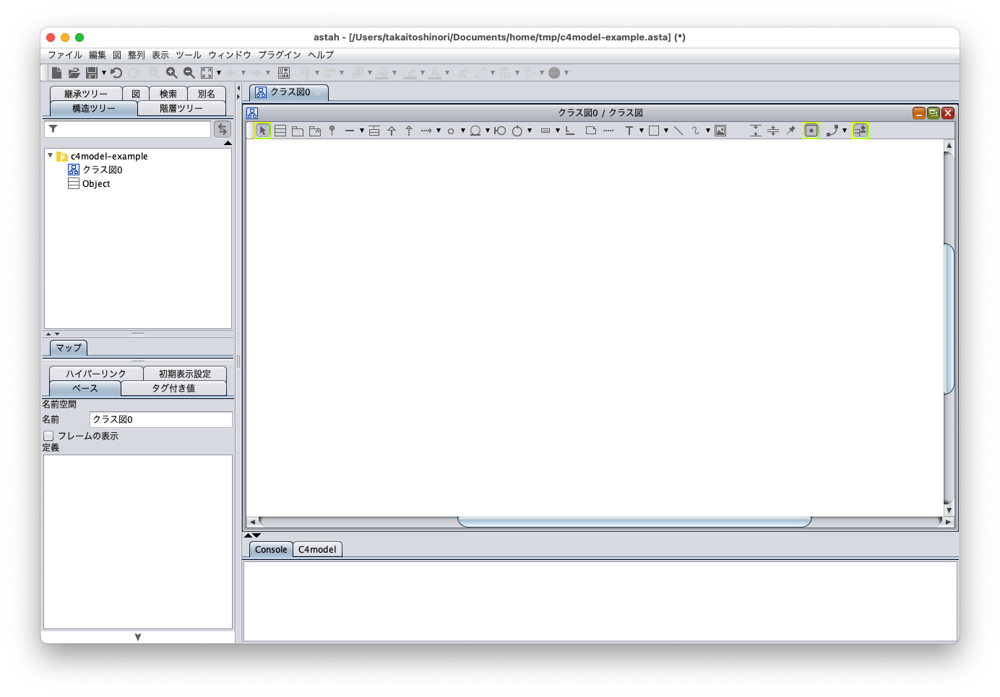
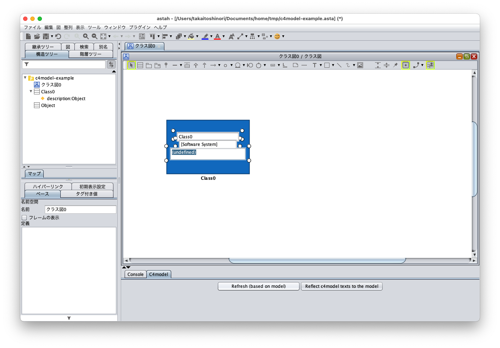
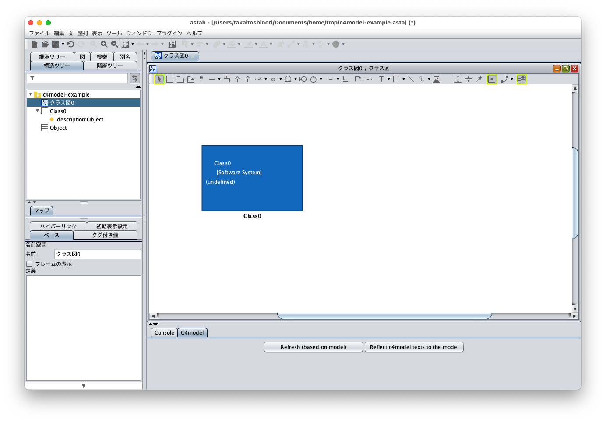
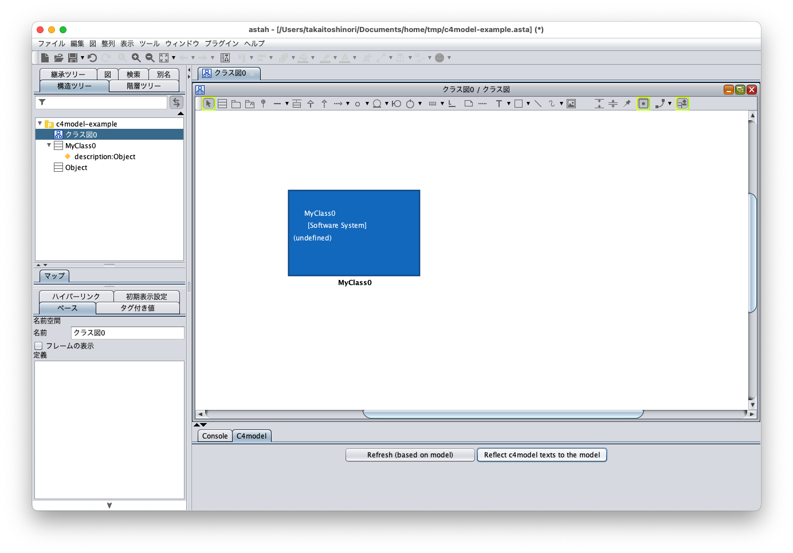
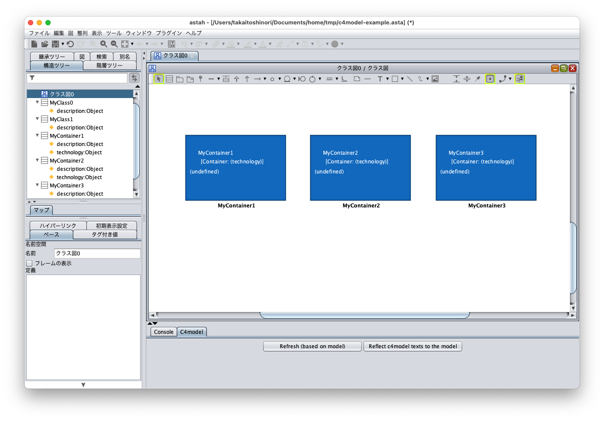
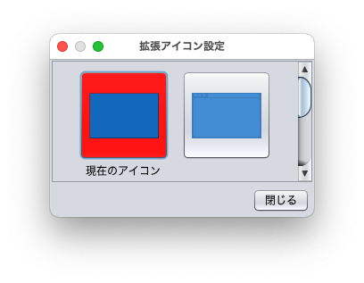
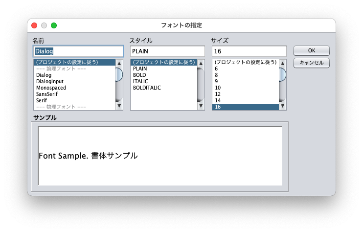
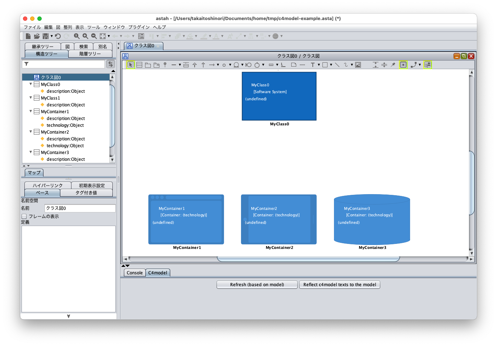
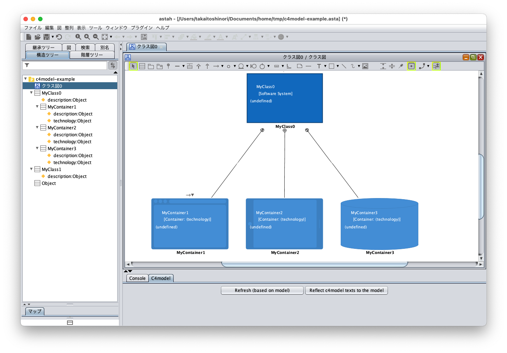
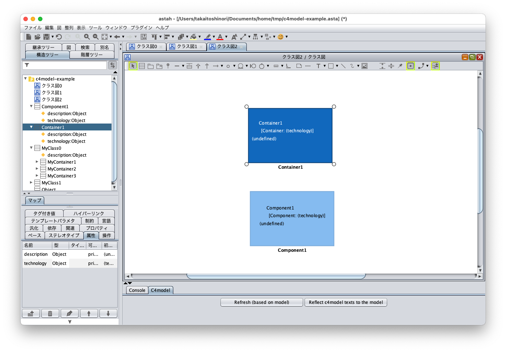

Astah C4 model plugin
===============================

Version
----------------

1.1

Available for
----------------
astah* professional 8.3 or later, astah* UML 8.3 or later

Description
----------------
A plugin for constructing [C4 model](https://c4model.com).

How to install
----------------
0. Download .jar file from
   https://github.com/ChangeVision/astah-c4model-plugin/releases/tag/v1.0
1. Launch Astah and drag the downloaded .jar file to an open instance of Astah. A pop-up will appear asking you to confirm installation, choose [Yes].
2. If the pop-up opens, restart Astah and open any project.
3. Now you will have [C4 model] Tab in the Extension View below the Diagram Editor.

How to use
----------------
### Setup

1. Open project [c4model-skeleton.asta] in the [sample] folder.
    
   - You can see the stereotypes with the associated SVG images registered to the project.  You can register two or more images to one stereotype.
   - Another way is to use the svg image files, which are registered in the c4model-skeleton.asta project file, placed at the same place in the zip format.  Please check [a manual page of Astah](https://astah.net/support/astah-pro/user-guide/stereotype-icon/)  and you can register those svg files as customized icons in an arbitrary existing Astah project.

### Basics on constructing a model of C4model

1. Create a class diagram.
   
2. Create a class with a stereotype «Software System» on that diagram. One of the possible ways to add a stereotype to a class is first you select a class on a diagram, then you can see a property view for the class and you can choose stereotypes from a pull-down menu in the stereotype tab.  Although, for modeling with the C4 model, several specific stereotypes are used, you can also introduce arbitrary stereotypes.   
   
3. If a created class has a C4 model stereotype, then the diagram element of the class will be expressed as the corresponding C4 model diagram element.  If the diagram element has not been changed, , push "Refresh (based on model)" button on C4model Tab in Extension Tab.
   
   - At this point, fix those texts. Then the status will be changed as follows:
     
     As you can see, the name of and the stereotype are placed on the Customized Icon associated with the stereotype «Software System».  Moreover, if the target class does not have an attribute named "description", then the triggered actions by the button include to introduce that attribute and set "(undefined)" as an initial value.
4. The next action is to edit attributes of C4 model elements through diagram elements. Change the Text in Diagram representing the class name through the Diagram editor.  Change from "Class0" to "Class1".
   
   - Take a look at the structure tree and you will see the model has been changed.
     If no change on the diagram has been recognized, push "Reflect c4model texts to the model".
     

### Create relations between model elements in C4model
1. Prepare any two C4 model model elements as follows.
   
2. Next, try to draw dashed arrow between two diagram elements of the C4 model. The dashed arrow means a dependency relation in the UML context .
   
3. Here, write the definition of the dependency relation.  A definition of an dependency relation can be inputted through the property view of the relation.
   
   
### Use several Customized Icons for one stereotype
For example, you may want to use different Customized Icons for different C4 model elements those have the same ≪Container≫ stereotype.
Astah supports associating two or more Customized Icons for one stereotype.
In the skelton project file you downloaded, several Customized Icons for «Container» and «Software System» are already associated. Let's try it.
1. First, prepare some Container elements.
   
2. Next, choose one and click with your right mouse button, then you will see a Context menu.  
   From the menu, choose "Set Customized Icon ...",
   
   - then you will see the Customized Icon Set Window as follows.
      
3. Among the registered Customized Icons shown in the window, choose any icon. For example, if you choose the application-look icon, then the appearance of the model element will be changed as follows:  
   
4. Changing the Customized Icons for other model elements, for example, containers can be represented with several appearances as follows:
   
   
### Changing font size
1. Choose any text on a Customized Icon that you want to change its font size and push the "Set Font" button in the tool buttons.
   
2. For example, choose font size 16.
   
3. You can see the font of the text gets larger.
   
### Create abstraction relation
Next let us see how we can create and represent abstract relations among model elements, which is indispensable in C4 model modeling.  Assume you want to model the situation that some software system is concretized into three Containers,  MyContainer1, MyContainer2, and MyContainer3.
1. First, prepare model elements.
   
2. Then, associate them with nest relations.   A nest relation can be created, for example, through the button in the tool bar.
   
   - Here, from the Structure Tree, you can recognize the nest relations you created are reflected to the model structure.
3. After associating model elements with nest relations, push "Reflect c4model texts to the model" button in the C4model Tab.
   
   You can see that a Rectangle representing the abstraction relation.  More precisely, the rectangle covers model elements those has the common parent model element with respect to the nest relation.
   Such rectangles will be displayed even if a parent model element does not appear in the same diagram.  That is, a set of model elements in  diagram that share the common parent model element in the Structure Tree would be covered by a rectangle.   
4. Let us try with a newly created diagram.
   Create a new class diagram in the same project.
   
5. Let us deploy diagram elements of the existing model elements.  More precisely, drag the models  MyContainer1，MyContainer2，MyContainer3, and MyClass1 from the Structure Tree and drop them on to the diagram.
6. Then align those elements appropriately.
   
   As you see, the diagram elements MyContainer1，MyContainer2，MyContainer3 that have the common parent model element are covered by a rectangle with the information on the parent model.
### Others
* For Container and Component model elements, an attribute "technology" would be introduced and displayed on the diagram element after the stereotype name, i.e. "Component: (technology)" where "(technology)" is replaced by the value of the "techonology" attribute".
  
* For relations, there is no special place to store the technology attribute.  To draw technologies for relations, for example, just write information on technology in the definition of the dependency relation as follows.
  
* Note that the "undo" action for an action for C4model elements, e.g. a move,  requires several actions of holding button down since one action of "Reflect c4model texts to the model" button implies several Astah editing actions.

License
---------------
Copyright 2021 Change Vision, Inc.

Licensed under the Apache License, Version 2.0 (the "License");
you may not use this work except in compliance with the License.
You may obtain a copy of the License in the LICENSE file, or at:

<http://www.apache.org/licenses/LICENSE-2.0>

Unless required by applicable law or agreed to in writing, software
distributed under the License is distributed on an "AS IS" BASIS,
WITHOUT WARRANTIES OR CONDITIONS OF ANY KIND, either express or implied.
See the License for the specific language governing permissions and
limitations under the License.
