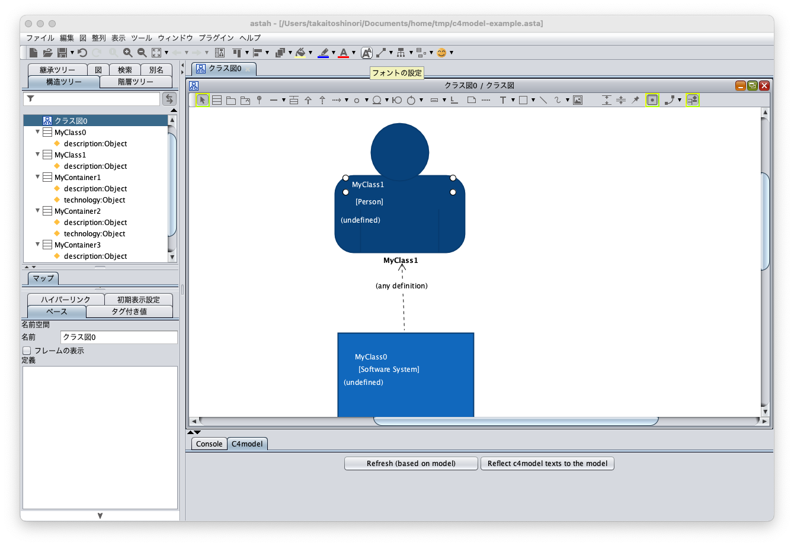

astah* C4 model プラグイン
===============================

Version
----------------
1.0

Available for
----------------
astah* professional 8.3 or later

Description
----------------
[C4 model](https://c4model.com)を書くためのプラグインです。

How to install
----------------
[ここから、プラグイン.jarファイルをダウンロードします。](http://astah.change-vision.com/ja/feature/redmine.html)

### astah* UML、professional、SysMLをご利用の場合
1. 上部メニュー[ヘルプ] – [プラグイン一覧] からプラグイン一覧を開きます。
2. [インストール] ボタンをクリックし、jarファイルを選択してインストールしてください。
3. astah* を再起動し、プロジェクトを開きます。
4. 下部の拡張ビューに[C4model]タブが追加されます。

(astah* UML、professional 6.8以降をご利用の場合は、ダウンロードした.jarファイルを、astah*のツールバーにドラッグ＆ドロップすることでもインストールが可能です。)

使い方
----------------
### セットアップ

1. c4model-skeleton.astaを読み込みます。
   
    - 構造ツリーのルートを選択することにより，  プロパティービューの「プロファイルーステレオタイプ」タブに，登録されているステレオタイプと SVG画像を確認することができます。 同じステレオタイプに対して複数の画像を登録することもできます。

### モデル作成の基本

1. クラス図を作ってください。
   
2. 図上にステレオタイプ≪Software System≫をもつクラスを作成してください。ステレオタイプは例えば，図上のクラスを選択し，プロパティービューからステレオタイプタブを選択すると入力することができます。任意の名前のステレオタイプを入力することができますが，上記スケルトンファイルを利用している場合は，≪Software System≫など，C4 modelで使われるものは用意されているので，それを選択することにより入力します。
   
3. 次に，作成したクラス図を表示している状態で，C4model拡張タブにある「Refresh（based on model）」ボタンを押してみてください。
   押した直後は次のような画面になっていると思います。   
   
   - ここではいったんこれらの文字を確定させてください。次のような画面になります。
     
     このように，クラス名とステレオタイプ名がテキストとしてアイコンの上に載ります。さらに，「description」という属性がない場合には，
     それが導入され，初期値として「(undefined)」という値が設定されます。
   - ここで，図上のクラスを表す青色の四角いアイコンの位置を少しずらしてみてください。
     
   - アイコンの上にある文字は，そのままではアイコン本体と位置がずれてしまいます。そこで，もう一度，C4model拡張タブにある「Refresh（based on model）」ボタンを押してみてください。
      
     このように，拡張アイコンに載っている文字列は独立した文字列ですが，自動的に再配置してくれるのが分かると思います。
4. 次に，作成したC4 modelのモデル要素を図上から編集してみます。クラス名を変えてみましょう。図上でクラス名を「Class0」から「MyClass1」に 変更してみましょう。
   
   - 構造ツリーを見てみましょう。この状態では，モデルの方はクラス名は変更されていないことが分かります。 
     そこで，C4model拡張タブにある「Reflect c4model texts to the model」ボタンを押してみましょう。
     
     ここでようやく，モデル上のクラス名にも変更が反映されたことが分かります。

### モデル間の関係の作成
1. 何か二つ要素を作っておいてください。
   
2. 次に，二つの要素の間に点線の矢印を引いてみます。UMLにおいては依存関係になります。
   
3. ここで，この依存関係の定義を書きます。定義は，依存関係を選択し，そのプロパティービューから入力します。
   
   
4. 入力を確定したあと，C4 model拡張タブにある「Reflect c4model texts to the model」ボタンを押してみましょう。
   
このように，定義が図上に反映されます。

### 様々な拡張アイコンを利用する
例えば同じ≪Container≫をもつ要素であっても，図上のアイコンを複数種類使いたい場合もあると思います。astah*では，一つのステレオタイプに複数の拡張アイコンを登録することができます。前述のスケルトンプロジェクトファイルにも，≪Container≫や≪Software System≫には複数のアイコンが登録されています。ここではそれを試してみましょう。
1. まず，いくつかコンテナの要素を準備してみましょう。

2. 次に， どれか一つの要素を右クリックし，コンテキストメニューから「拡張アイコン設定...」を選びます。
   すると次のような新しいウィンドウが立ち上がります。

   
3. この中から，好きなアイコンを選択してみましょう。例えばアプリケーション風のアイコンを選択すると次のようにアイコンが変更されます。
   
4. 他の要素も変更すると，例えば次のように，同じコンテナでも異なるアイコンを利用することができます。
   
   
### フォントの大きさを変えてみる
1. アイコンの上に載っているテキストの中で，フォントの大きさを変えたいテキストを選択した状態で，ツールボタンの中の「フォントの設定を選びます」
   
2. 例えばフォントサイズを16を選んでみましょう
   
3. フォントが大きくなっていると思います。
   
### 抽象化関係の作成
次に，C4 modelの特徴である抽象化関係を作成してみましょう。
例えば，ソフトウェアシステムがコンテナMyContainer1，MyContainer2，MyContainer3からなるモデルを 作成してみます。
1. はじめにそれぞれのモデルを作成します。
   
2. つぎに，それらのモデル要素をネスト関係によって関連付けてみましょう。ネスト関係は，クラス図のツールバーにあります。
   
   - ここで，構造ツリーをみると，モデル上でもネスト関係になっていることが確認できると思います。
3. それでは，ネスト関係によって関連付けたところで，改めてC4model拡張タブにある「Reflect c4model texts to the model」ボタンを押してみましょう。
   
   抽象化関係を表す枠線が表示されています。この枠線は，ネスト関係による共通の親クラスを持つ要素のあつまりがあった場合には，その親クラスの名前とともに導入されます。これは同じ図内に親クラスがなくても，モデル上に（つまり構造ツリーのほうで）ネスト関係による共通の親クラスがあれば表示されるものです。
   
4. たとえば別の図で試してみましょう。同じプロジェクト内で新規にクラス図を作成してください。
   
5. この図に既存のモデルを配置してみましょう。具体的には，構造ツリーから，MyClass1，MyContainer1，MyContainer2，MyContainer3を図上にドラッグアンドドロップしてください。
   
   ドラッグアンドドロップした直後はこのような状態になっていると思います。
6. 適切に配置しなおしましょう。
   
7. この状態で改めてC4 model拡張タブにある「Reflect c4model texts to the model」ボタンを押してみましょう。
   
   このように，ネスト関係による共通の親クラスのあるMyContainer1，MyContainer2，MyContainer3に枠線が導入された状態でc4modelの表示にすることができます。

### その他
* コンテナ要素及びコンポネント要素には，属性としてtechnology（技術）が導入され，その初期値が図上の「Container: 〇〇」 （または「Component: 〇〇」）の〇〇の位置に表示されます。
  
* 関係については，「技術」 を書く特別な場所を用意していません。従って，関係の説明に続けて，依存関係の定義に記述してください。
  
* 「Reflect c4model texts to the model」ボタンはアンドゥ操作が多数必要になることに注意してください。このボタンを押下することによって生じるastah*上の操作はテキストを複数作成するなど複数になりますので，その回数分アンドゥ操作が必要になります。

License
---------------
Copyright 2021 Change Vision, Inc.

Licensed under the Apache License, Version 2.0 (the "License");
you may not use this work except in compliance with the License.
You may obtain a copy of the License in the LICENSE file, or at:

<http://www.apache.org/licenses/LICENSE-2.0>

Unless required by applicable law or agreed to in writing, software
distributed under the License is distributed on an "AS IS" BASIS,
WITHOUT WARRANTIES OR CONDITIONS OF ANY KIND, either express or implied.
See the License for the specific language governing permissions and
limitations under the License.
